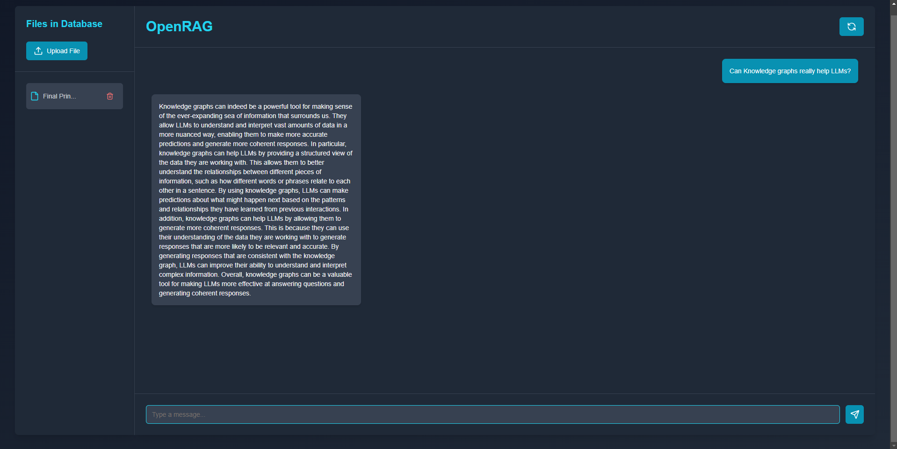

# OpenRAG
RAG based LLM under 1GB.  
OpenRAG is a Retrieval-Augmented Generation (RAG) system designed to provide intelligent responses by combining vector similarity searches with a language model (LLM). The system uses a vector database to retrieve contextually relevant documents and leverages the power of **Ollama's Qwen2:0.5b** as the LLM to generate responses based on the retrieved context.

## Table of Contents

- [Features](#features)
- [Tech Stack](#tech-stack)
- [How It Works](#how-it-works)
- [Installation](#installation)
- [Usage](#usage)
- [Contributing](#contributing)
- [License](#license)




## Features

- **Vector Database**: Uses `sqlite3` to store and query text embeddings.
- **LLM Integration**: Leverages **Ollama's Qwen2:0.5b** for natural language generation.
- **Embeddings Generation**: Uses `nomic-embed-text` to generate vector embeddings for input documents.
- **Next.js Frontend**: A simple and interactive frontend built with Next.js to interact with the system.
- **Contextual Responses**: Generates responses by searching a vector database and using relevant documents as context.

## Tech Stack

- **Vector Database**: `sqlite3` for storing and querying document embeddings.
- **LLM**: `Ollama: Qwen2:0.5b` as the primary language model for generating responses.
- **Embeddings**: `nomic-embed-text` for generating text embeddings from the input data.
- **Frontend**: `Next.js` for building the user interface.
- **Backend**: The backend is built using Node.js and its ecosystem.

## How It Works

1. **Embedding Generation**: 
   - Documents are converted into vector embeddings using `nomic-embed-text`.
   
2. **Vector Database**:
   - The generated embeddings are stored in a `sqlite3` database.
   - When a user sends a query, the system searches the vector database for documents with embeddings most similar to the query.

3. **Contextual Querying**:
   - The retrieved documents are used as context, appended to the user’s query, and passed to the language model (LLM).

4. **Response Generation**:
   - **Ollama's Qwen2:0.5b** generates a response based on the provided context and the user query.
   
5. **Next.js Frontend**:
   - The frontend provides a user-friendly interface to submit queries and view responses from the RAG system.

## Installation

### Prerequisites

- **Node.js**: Ensure you have Node.js installed.
- **SQLite3**: Install SQLite3 to manage the vector database.
- **Ollama LLM API**: Ensure the Ollama service is running on your system.
- **nomic-embed-text**: Install the `nomic-embed-text` library for generating text embeddings.

### Steps

1. Clone the repository:

   ```bash
   git clone https://github.com/SujalChoudhari/OpenRAG.git
   cd OpenRAG
   ```

2. Install dependencies:

   ```bash
   npm install
   ```

3. Set up SQLite3 database:

   You can create the SQLite3 database using the provided schema in the project, or adjust according to your needs.
4. Setup Ollama LLM API:
    
    Download the Ollama service and run it in the background.

5. Start the development server:

   ```bash
   npm run dev
   ```

   The Next.js app will now be running on `http://localhost:3000`.

## Usage

1. Upload documents via the Next.js frontend or directly into the `_data` directory.
2. Enter your queries into the chat interface.
3. The system will search for relevant documents in the vector database, and **Qwen2:0.5b** will generate a response based on the context.

## Contributing

Contributions are welcome! Please fork the repository, make your changes, and submit a pull request.

